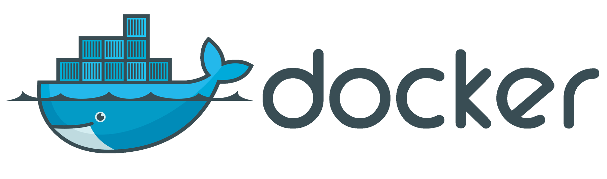

# Los básicos de Docker



## ¿Qué es Docker?

Docker es una plataforma de software que le permite crear, probar e implementar aplicaciones rápidamente. Docker empaqueta software en unidades estandarizadas llamadas contenedores que incluyen todo lo necesario para que el software se ejecute, incluidas bibliotecas, herramientas de sistema, código y tiempo de ejecución. Con Docker, puede implementar y ajustar la escala de aplicaciones rápidamente en cualquier entorno con la certeza de saber que su código se ejecutará.

## Instalación de Docker en Fedora:

Para instalar docker en Ferdora seguiremos los siguientes pasos:

- Eliminar versiones antiguas de Docker:

```sh
sudo dnf remove docker \
                  docker-client \
                  docker-client-latest \
                  docker-common \
                  docker-latest \
                  docker-latest-logrotate \
                  docker-logrotate \
                  docker-selinux \
                  docker-engine-selinux \
                  docker-engine
```

- Instalaremos el paquete dnf-plugins-core para manefar nuestros repositorios dnf.

```sh
sudo dnf -y install dnf-plugins-core
```

- El siguiente pasó será agregar el repositorio.

```sh
sudo dnf config-manager \
    --add-repo \
    https://download.docker.com/linux/fedora/docker-ce.repo
```

- Instalar Docker:

```sh
sudo dnf install docker-ce docker-ce-cli containerd.io docker-compose-plugin
```

- Arrancar Docker:

```sh
sudo systemctl start docker
```

- Comprobar el estado del contenedor:

```sh
sudo systemctl status docker
```

Podemos obtener información acerca de como instalar Docker en Fedora en el siguiente enlace: < https://docs.docker.com/engine/install/fedora/ >.

## Descargar una imágen:

Si queremos utilizar los contenedores, por lo general, deberemos descargarlos de un repositorio para contenedores.

El repositorio público de contenedores más famoso es Docker Hub. Podemos acceder a él en < https://hub.docker.com/ >.

Una vez estemos en Docker Hub buscaremos la funcionalidad que necesitamos. Para el ejemplo voy a buscar un contenedor de NodeJS.

Una vez hayamos encontrado la imágen que estamos buscando copiaremos el comando docker pull que nos indica. En este caso será < docker pull node >.

Ejecutaremos el comando en nuestra terminal para descargar la imágen de Docker.

Si, después de que termine el proceso ejecutamos de nuevo el comando < docker images >, la nueva imágen del repositorio node aparecerá listada.

Si queremos una versión completa también podemos especificarlo en el mismo comando docker pull. En el caso que estamos utilizando como ejemplo vamos a intalar la versión 16 de node. Para ello ejecutamos < docker pull node:16 >.

## Eliminar una imágen:

Para borrar una imágen ejecutaremos el comando < docker image rm > pasándole como argumento el nombre de la imágen. En el caso de tener varias imágenes procedentes del mismo repositorio especificaremos el TAG de la siguente manera: < docker image rm node:16 >. En caso de que tuviéramos tan solo una imágen de node ejecutaríamos < docker image rm node >. Si queremos eliminar varias imágenes con una única instrucción podemos pasarle a docker image rm tantas imágenes como queramos ya que admite n argumentos.

## Instanciar un contenedor:

Una vez tengamos nuestra imágen el siguiente paso será crear una instancia de esa imágen. Esta instancia constituirá el contenedor propiamente dicho.

Para crear una instancia de la imágen "node" ejecutaremos el comando < docker create node >. Si todo va correctamente esta instrucción nos devolverá una cadena de caracteres que empezará con el id que le ha sido asignado a este nuevo contenedor.

Para listar todos nuestros contenedores utilizaremos el comando < docker ps -a >.

Una vez lo hayamos hecho veremos que aparece nuestro contenedor de node y también apreciaremos que tiene varias propiedades. Una de estas propiedades es un nombre que se le ha asignado. Si queremos que determinar en nombre del contenedor, por ejemplo "node-container", al crearlo usaremos el comando < docker create --name node-container node >.

## Listar contenedores:

Para listar los contenedores arrancados utilizatemos el comando < docker ps >. Este comando nos mostrará únicamente los contenedores que se encuentren arrancados. Si queremos ver todos los contenedores instanciados ejecutaremos < docker ps -a >.

## Arrancar un contenedor:

Para este ejemplo vamos a crear un contenedor de MongoDB, de modo que, en primer lugar, ejecutamos el comando < docker pull mongo > para descargar la imágen oficial de Docker Hub para después instanciar un contenedor llamado mongo-container con la instrucción < docker create --name mongo-container mongo >.

Una vez tengamos el contenedor de mongo preparado ya podemos arrancarlo mediante el comando < docker start mongo-container >.

Si ahora ejecutamos el comando < docker ps > nos aparecerá listado nuestro contenedor.

## Conectarse a un contenedor desde nuestro sistema operativo:

Si nosotros arrancamos un servicio de MongoDB en nuestro sistema operativo este corre por defecto en el puerto 27017 de nuestra máquina. En el caso de que lo arranquemos dentro de un contenedor de Docker sucederá lo mismo con la salvedad de que el puerto será el 27017 de nuestro contenedor.

El problema que tiene esto es que no nos va a ser posible acceder a este servicio desde nuestro sistema operativo de manera directa. Para resolver esto tendremos que mapear uno de los puertos de nuestro sistema operativo a aquel en el que está corriendo MongoDB dentro del docker.

Este mapeo deberá hacerse en el momento de la creación del contenedor de modo que vamos a crear un contenedor llamado mongo-test, indicándo que queremos que el puerto 27016 de nuestro sistema operativo (podría ser cualquier otro que estuviese libre) se mapee al 27017 de esta nueva instancia. Para llevarlo a cabo ejecutaremos el comando < docker create -p27016:27017 --name mongo-test mongo >.

Acto seguido, arrancaremos el contenedor con el comando < docker start mongo-test >.

Ahora ya estamos en disposición de conectarnos a este docker de mongo-test. Como lo vamos a hacer desde nuestro sistema operativo tendremos que apuntar a < mongodb://localhost:27016 >.

## Auditar los logs de un contenedor:

Para ver los logs de un contenedor que tengamos arrancado ejecutaremos < docker logs > seguido del nombre del contenedor. En el caso de que tengamos arrancado el contenedor mongo-test veremos sus logs ejecutando docker logs mongo-test.

Este comando nos mostrará los logs acontencidos hasta ese momento para luego devolvernos de nuevo a la línea de comandos.

Si queremos que docker logs se mantenga a la escucha lanzaremos < docker logs mongo-test --follow >.

## Docker run:

El comando < docker run > contiene las funcionalidades de pull, create y start. Esto quiere decir que si eliminamos nuestros contenedores de mongo y también la imágen para después ejecutar < docker run mongo > se descargará la imaǵen de mongo, se creará un nuevo contenedor y se arrancará de manera inmediata mostrándonos los logs.

Si queremos aplicar las funcionalidades vistas anteeriormente para fijar el nombre del contenedor (por ejemplo, mongo-container) y mapear el puerto de nuestro sistema operativo (en este caso usaremos el 27016) tendremos que ejecutar el comando < docker run --name mongo-container -p27016:27017 mongo >.

Para dejar nuestro contenedor corriendo en segundo plato utilizaremos la opción -p, quedando nuestro comando de la siguiente manera: < docker run -p --name mongo-container -p27016:27017 mongo >.

## Habilitar permisos para tu usuario:

Si vemos que nos resulta necesario utilizar sudo para utilizar Docker tenemos la opción de incluirnos en un grupo. Para hacerlo seguiremos los siguientes pasos:

- Crearemos un grupo para docker

```sh
sudo groupadd docker
```

- Añadiremos nuestro usuario al grupo

```sh
sudo usermod -aG docker $USER
```

- Cerrar sesión y volver a entrar

## Mantener el servicio de Docker arrancado por defecto

En algunas distribuciones de Linux el servicio de docker no se arranca por defecto al iniciar sesión. Para evitar tener que ponero en marcha con systemctl cada vez arranquemos el equipo ejecutaremos los siguientes comandos:

```sh
sudo systemctl enable docker.service
```

```sh
sudo systemctl enable containerd.service
```

Si queremos revertir estos cambios podemos hacerlo ejecutando los comandos:

```sh
sudo systemctl disable docker.service
```

```sh
sudo systemctl disable containerd.service
```
